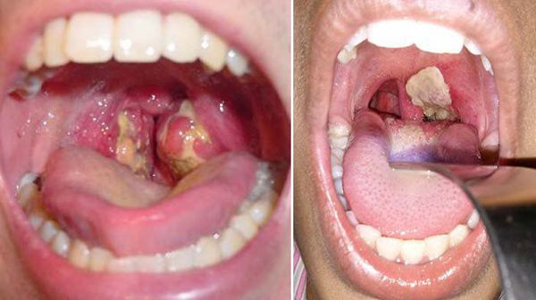

= Безопасность Жизнедеятельности Человека: Вирус Марбург и Дифтерия
Александр Дудкин, Иван Прокопеня
:revealjs_theme: black
:revealjs_customtheme: white_course.css
:revealjs_slideNumber: true
:revealjs_progress:
:revealjs_history:
:encoding: UTF-8
:lang: ru
:doctype: article
:toclevels: 3
:source-highlighter: highlightjs
:highlightjsdir: highlight
:icons: font
:revealjs_mouseWheel: true
:revealjs_center: false
:revealjs_transition: none
:revealjs_width: 1600
:revealjs_height: 900
:sectnums!:
:!figure-caption:

== Цели презентации

[%step]
* Изучить основные характеристики вируса Марбург и дифтерии
* Рассмотреть методы их диагностики и лечения
* Обсудить профилактические меры для предотвращения распространения болезней

== Вирус Марбург

[cols="50a,50a", frame="none", grid="none"]
|===
| image::images/virus_marburg.jpg[Вирус Марбург под микроскопом]
| image::images/virus_marburg_2.jpg[Вирус Марбург на теле]
|===

== Вирус Марбург

[%step]
* Геморрагическая лихорадка с высокой смертностью, вызванная вирусом Марбург
* Первая вспышка зарегистрирована в 1967 году в Германии и Югославии
* Природный резервуар: африканские летучие мыши Rousettus aegyptiacus
* Смертность при вспышках варьируется от 24% до 88%, в зависимости от штамма и условий лечения

== Пути передачи и диагностика

[%step]
* Основной путь передачи: контакт с биологическими жидкостями инфицированных людей или животных
* Диагностика: анализы крови, ПЦР-тестирование, изоляция вируса
* Быстрая диагностика важна для предотвращения распространения инфекции

== Симптомы и течение болезни
[cols="20a,80a"]
|===
| Симптомы | Высокая температура, сильная головная боль, ломота в теле, слабость
| Прогрессирование | Кровотечения из десен и носа, многократная рвота, нарушение функций печени и почек
| Финальные стадии | Нарушение работы органов, внутренние кровотечения, шок и смерть
|===

== Лечение и профилактика

[%step]
* Специфическое лечение не разработано, применяется поддерживающая терапия
* Клинические исследования вакцин продолжаются
* Профилактика: строгий инфекционный контроль, изоляция инфицированных, использование средств защиты для медицинского персонала

== Роль ВОЗ и медицинских организаций в борьбе с инфекциями

[%step]
* Всемирная организация здравоохранения (ВОЗ) координирует меры по борьбе с инфекционными заболеваниями, включая вирус Марбург и дифтерию
* Международные программы по разработке вакцин и обучению медицинских работников
* Обеспечение стран с низким уровнем дохода средствами для диагностики и лечения инфекций
* Постоянный мониторинг за вспышками инфекций и своевременные рекомендации для населения

== Влияние изменений климата на распространение инфекций

[%step]
* Потепление климата способствует изменению ареала обитания переносчиков инфекций, таких как летучие мыши — резервуары вируса Марбург
* Изменения климата влияют на миграцию животных, что увеличивает риск контакта людей с вирусоносителями
* Влажность и температура могут способствовать выживанию бактерий, вызывающих дифтерию
* Необходимы адаптированные методы контроля инфекций с учётом климатических изменений

== Дифтерия

== Дифтерия

[%step]
* Бактериальная инфекция, вызванная Corynebacterium diphtheriae
* Передача: воздушно-капельным путем или через предметы общего пользования
* Поражает дыхательные пути и реже - кожу, глаза и нервную систему
* Без лечения может привести к тяжёлым осложнениям, таким как миокардит или паралич

== Пути передачи и диагностика

[%step]
* Передача от человека к человеку, чаще всего при чихании или кашле
* Диагностика: бактериологический посев, ПЦР, серологические тесты на антитоксины
* Важно своевременно распознать болезнь для предотвращения её распространения

== Симптомы и течение болезни
[cols="20a,80a"]
|===
| Инкубационный период | Обычно 2-5 дней
| Начальные симптомы | Боль в горле, налет серого цвета на миндалинах, затрудненное дыхание
| Прогрессирование | Появление опухолей на шее, общая слабость, осложнения на сердце и нервную систему
|===

== Лечение и профилактика

[%step]
* Лечение: антибиотики (например, эритромицин) и антитоксин
* Профилактика: вакцинация АКДС, регулярные ревакцинации для поддержания иммунитета
* Вспышки болезни контролируются вакцинацией и наблюдением за контактами больных

== Симптомы Дифтерии

[%step]
* Наиболее характерный - серо-белые пленочные налеты на небе, миндалинах, задней стенке гортани
* Незначительная боль при глотании
* Повышение температуры
* Увеличение миндалин или лимфоузлов
* Отечность шеи
* Сладковатый запах изо рта

== Методы передачи

[%step]
* Воздушно-капельный путь
* Контактный путь
* Половой путь (для некоторых инфекций)

== Рекомендации

[%step]
* Быстрое обращение к врачу при появлении первых симптомов
* Соблюдение правил личной гигиены
* Вакцинация и регулярные медицинские осмотры

== Вирус Марбург vs. Дифтерия
[cols="30a,35a,35a", options="header"]
|===
| Параметр | Вирус Марбург | Дифтерия
| Возбудитель | Вирус семейства Filoviridae | Бактерия Corynebacterium diphtheriae
| Передача | Через контакт с биологическими жидкостями, резервуар — летучие мыши | Воздушно-капельный путь, бытовые предметы
| Летальность | Высокая | Средняя, значительно снижается при лечении
| Профилактика | Инфекционный контроль и изоляция | Вакцинация
|===

== Исторические вспышки и статистика

[%step]
* Первая вспышка вируса Марбург — 1967 год, в лабораториях Германии и Югославии
* Наибольшее число случаев зафиксировано в Африке, особенно в Уганде и Демократической Республике Конго
* Дифтерия была широко распространена в начале 20-го века, но с внедрением вакцинации заболеваемость резко снизилась
* Несмотря на вакцинацию, в некоторых регионах вспышки дифтерии происходят из-за снижения уровня прививок

== Заключение

[%step]
* Важность быстрой диагностики и контроля при вспышках вируса Марбург
* Эффективность вакцинации как основной меры предотвращения дифтерии
* Необходимость изучения и разработки более совершенных методов лечения и вакцин
* Роль общества и медицины в предотвращении эпидемий и защите населения
