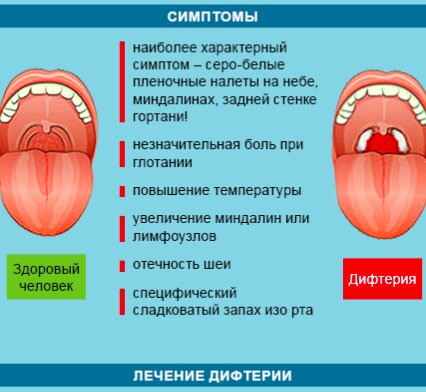

= Болезни: вирус Марбург и Дифтерия
Александр Дудкин, Иван Прокопеня
:revealjs_theme: black
:revealjs_customtheme: white_course.css
:revealjs_slideNumber: true
:revealjs_progress:
:revealjs_history:
:encoding: UTF-8
:lang: ru
:doctype: article
:toclevels: 3
:source-highlighter: highlightjs
:highlightjsdir: highlight
:icons: font
:revealjs_mouseWheel: true
:revealjs_center: false
:revealjs_transition: none
:revealjs_width: 1600
:revealjs_height: 900
:sectnums!:
:!figure-caption:
:revealjs_transition: fade

== Цели презентации
* Изучить основные характеристики вируса Марбург и дифтерии
* Рассмотреть методы их диагностики и лечения
* Обсудить профилактические меры для предотвращения распространения болезней

== Вирус Марбург
=== Основная информация
* Геморрагическая лихорадка с высокой смертностью, вызванная вирусом Марбург
* Первая вспышка зарегистрирована в 1967 году в Германии и Югославии
* Природный резервуар: африканские летучие мыши Rousettus aegyptiacus
* Смертность при вспышках варьируется от 24% до 88%, в зависимости от штамма и условий лечения

=== Пути передачи и диагностика
* Основной путь передачи: контакт с биологическими жидкостями инфицированных людей или животных
* Диагностика: анализы крови, ПЦР-тестирование, изоляция вируса
* Быстрая диагностика важна для предотвращения распространения инфекции

=== Симптомы и течение болезни
[cols="20a,80a"]
|===
| Симптомы | Высокая температура, сильная головная боль, ломота в теле, слабость
| Прогрессирование | Кровотечения из десен и носа, многократная рвота, нарушение функций печени и почек
| Финальные стадии | Нарушение работы органов, внутренние кровотечения, шок и смерть
|===

=== Лечение и профилактика
* Специфическое лечение не разработано, применяется поддерживающая терапия
* Клинические исследования вакцин продолжаются
* Профилактика: строгий инфекционный контроль, изоляция инфицированных, использование средств защиты для медицинского персонала

== Вирус Марбург

== Дифтерия
=== Основная информация
* Бактериальная инфекция, вызванная Corynebacterium diphtheriae
* Передача: воздушно-капельным путем или через предметы общего пользования
* Поражает дыхательные пути и реже - кожу, глаза и нервную систему
* Без лечения может привести к тяжёлым осложнениям, таким как миокардит или паралич

=== Пути передачи и диагностика
* Передача от человека к человеку, чаще всего при чихании или кашле
* Диагностика: бактериологический посев, ПЦР, серологические тесты на антитоксины
* Важно своевременно распознать болезнь для предотвращения её распространения

=== Симптомы и течение болезни
[cols="20a,80a"]
|===
| Инкубационный период | Обычно 2-5 дней
| Начальные симптомы | Боль в горле, налет серого цвета на миндалинах, затрудненное дыхание
| Прогрессирование | Появление опухолей на шее, общая слабость, осложнения на сердце и нервную систему
|===

=== Лечение и профилактика
* Лечение: антибиотики (например, эритромицин) и антитоксин
* Профилактика: вакцинация АКДС, регулярные ревакцинации для поддержания иммунитета
* Вспышки болезни контролируются вакцинацией и наблюдением за контактами больных

== Симптомы Дифтерии
[.text-center]

== Методы передачи
=== Виды заражения
* Воздушно-капельный путь
* Контактный путь
* Половой путь (для некоторых инфекций)

== Рекомендации
* Быстрое обращение к врачу при появлении первых симптомов
* Соблюдение правил личной гигиены
* Вакцинация и регулярные медицинские осмотры

== Сравнение двух болезней
=== Вирус Марбург vs. Дифтерия
[cols="30a,35a,35a", options="header"]
|===
| Параметр | Вирус Марбург | Дифтерия
| Возбудитель | Вирус семейства Filoviridae | Бактерия Corynebacterium diphtheriae
| Передача | Через контакт с биологическими жидкостями, резервуар — летучие мыши | Воздушно-капельный путь, бытовые предметы
| Летальность | Высокая | Средняя, значительно снижается при лечении
| Профилактика | Инфекционный контроль и изоляция | Вакцинация
|===

== Заключение
* Важность быстрой диагностики и контроля при вспышках вируса Марбург
* Эффективность вакцинации как основной меры предотвращения дифтерии
* Необходимость изучения и разработки более совершенных методов лечения и вакцин
* Роль общества и медицины в предотвращении эпидемий и защите населения

== Источники
* Статьи и исследования по теме вируса Марбург и дифтерии
* Всемирная организация здравоохранения (ВОЗ)
* Национальные и международные программы эпидемиологического контроля
